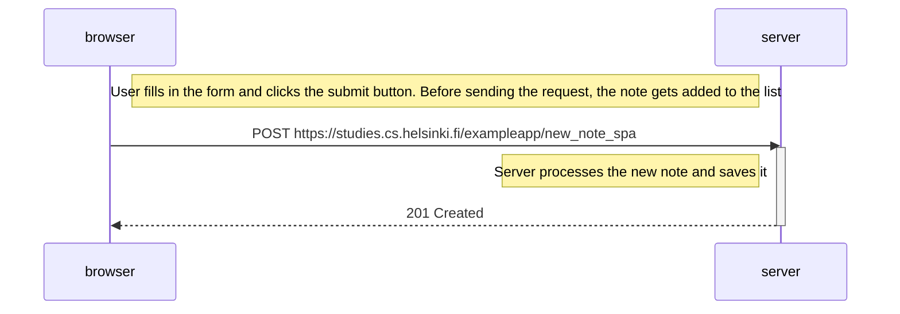

```mermaid
sequenceDiagram
    participant browser
    participant server
    

    Note right of browser: User fills in the form and clicks the submit button. Before sending the request, the note gets added to the list

    browser->>server: POST https://studies.cs.helsinki.fi/exampleapp/new_note_spa
    activate server
    Note left of server: Server processes the new note and saves it 
    server-->>browser: 201 Created  
    deactivate server

```